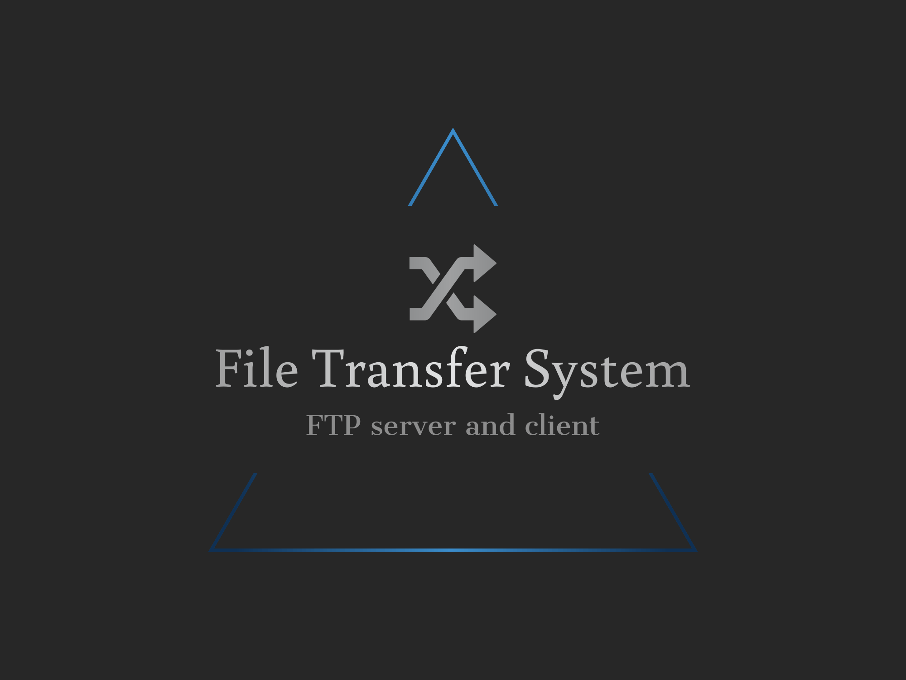

<div align="center">

  
  <h1>→ File Transfer System ←</h1>

</div>

<!-- Table of Contents -->

# 📔 Table of Contents

<ul style="list-style-type: none;">
    <li><a href="#about-the-project">🌟 About the Project</a>
        <ul style="list-style-type: none;">
            <li><a href="#description">📓 Description</a></li>
            <li><a href="#features">👀 Features</a></li>
            <li><a href="#tech-stack">👾 Tech Stack</a></li>
            <li><a href="#environment-variables">🔑 Environment Variables</a></li>
        </ul>
    </li>
    <li><a href="#getting-started">🧰 Getting Started</a>
        <ul style="list-style-type: none;">
            <li><a href="#prerequisites">⚠️ Prerequisites</a></li>
            <li><a href="#setup">⚙️ Setup</a></li>
            <li><a href="#run">🚀 Run</a></li>
        </ul>
    </li>
</ul>

## About the Project

### Description

<p>
An FTP Server and Client application built with Java. 
Upon initialization, the server will automatically generate a designated folder for file storage, should this folder not already be present. 
Subsequently, it will proceed to accept client connections, ready to receive and store files sent by the clients.
</p>

### Features

<ul style="list-style-type: none;">
  <li>✓ Support for concurrent client connections</li>
  <li>✓ File upload, download, and deletion capabilities</li>
  <li>✓ Directory navigation and file listing</li>
  <li>✓ Graphical User Interface for the client application</li>
  <li>✓ Password Authentication</li>
  <li>✓ Docker support</li>
</ul>

### Tech Stack

 <ul style="list-style-type: none;">
    <li><a href="https://www.java.com/">→ Java</a></li>
    <li><a href="https://maven.apache.org/">→ Maven</a></li>
    <li><a href="https://www.docker.com/">→ Docker</a></li>
    <li><a href="https://www.javatpoint.com/java-swing">→ Swing (for Client GUI)</a></li>
  </ul>

### Environment Variables

To run this project, you will need to add the following environment variables to your .env file

📁 `DEFAULT_PORT`

🌍 `DEFAULT_SERVER_NAME`

💾 `STORAGE_DIRECTORY_NAME`

🔒`SERVER_PASSWORD`

## Getting Started

### Prerequisites

 <ul style="list-style-type: none;">
   <li>★ Java JDK 17 or newer</li>
   <li>★ Maven</li>
   <li>★ Docker (optional for containerization)</li>
 </ul>

### Setup

#### Clone the project

```bash
  git clone https://github.com/nidorbRotkiv/FileTransferSystem.git
```

### Run

#### 1️⃣ Package the project

```bash
mvn package
```

#### 2️⃣ Run the server

```bash
mvn exec:java@run-server
```

#### 3️⃣ Run a client in a new terminal window (or tab)

```bash
mvn exec:java@run-client-gui
```


